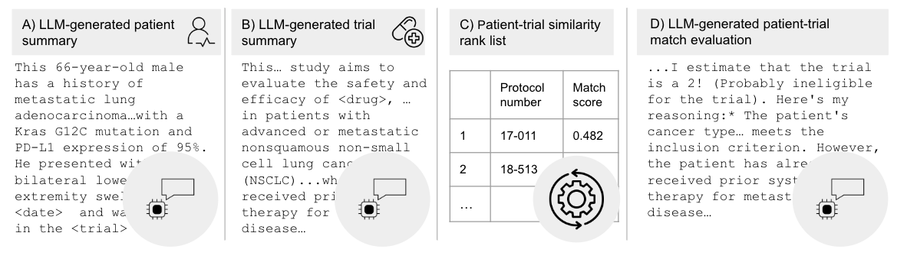

# ai-match-demo
This is a lightweight demonstration of an AI native clinical trial matching pipeline. 
The pipeline utilizes LLM-generated patient summaries (A), LL-generated trial summaries (B),
and a custom BERT based embedding model which is trained to embed patients into a similar
space as trials which they've enrolled in (C) and finally holistic trial eligibility 
assessment of specific patient-trial matchies using LLMs (D).



## Technical details

### .env
We use an environment variable to expose application parameters during testing phase. In production
these parameters are set in production environment. 

These same variables need to be in gitlab CI/CD variable section with K8S_SECRET_* prefix

### cert.pem
For now we have a self-signed certificate to get SSL on our connection to the AI server. Ask
James for these details.

## gcp
You'll need access to the GCP project for this. Please see James to get added.

## Building an deploying locally

We deploy this app in k8s cluster. It needs to be containerized so its good to check that you can
build the container locally and everything still works. Not absolutely necessary if you didn't
change any of the core logic.

The Docker build and run commands are wrapped in the `build_run.sh` script.

Build the app and run it.
```bash
./build_run.sh
```

Navigate to localhost:8501/mmai/app

Note for this to work you'll need to have a couple of things:
1. A proper .env file (see that section)
2. A gcp service account
3. cert.pem
3. Docker setup to allow volume mounting of these files into the container

## Development mode
Development is where you can edit the code directly. The following code helps setup your local environment.
You will need to have gcloud installed and likely have to run `gcloud auth login`.

1. checkout the code
2. run `poetry install`
3. run `poetry shell`
4. `panel serve ai_match_demo/app.py --autoreload --port 8501`